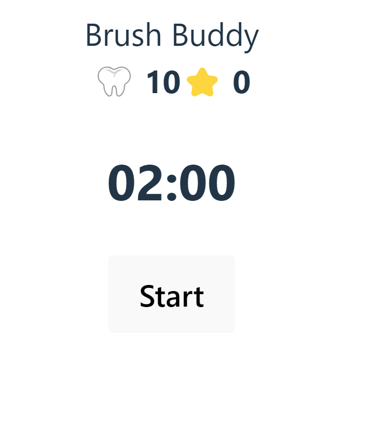

# Brush Buddy

## Table of Contents
* [Description](#description)
* [Installation](#installation)
* [Usage](#usage)
* [Contribution](#contribution)
* [Test](#test)
* [Technologies Utilized](#Technologies-Utilized)
* [Screenshot](#screenshot)
* [Link](#link)

## Description
This is an application intended to encourage daily brushing to improve and maintain oral hygeine.

## Installation
1. Fork the repository and clone it locally. Install the necessary dependancies using ```npm i``` and ```npm i --dev``` in the server directory and  ```npm i``` in the client directory. 
2. Create a postgresql database to store our user data. Create a local environment file ```.env.local``` in the server directory.  Write the relevant data: ``` DB_USER, DB_NAME, and DB_PASSWORD```pertaining to our postgresql database in the ```env.local``` file you created.
Be sure to have postgresql 14 or higher installed on your local machine.

3. Create a local environment file ```.env.local``` in the client directory as well and store the link to the server as: ```VITE_BASE_URL```. 

4. Relevant CLI:    
    - Express Server Side
        1. ```npm run migrate-latest``` to run migrations on the database 
        2. ```npm start``` to start the Express server
        3. To run a dev server use ```npm run express-dev``` instead 
    - Vite Client Side
        1. ```npm run dev``` 

## Usage 
 A user can log in and start a timer for 2 minutes. The timer shows how long the user should brush their teeth. Once the timer reaches 0, the user will recieve 2 stars, up to 4 per day. Flossing rewards 1 star, up to 2 per day, for a total maximum of 6 stars a day. Brushing will begin a daily streak score which will increase by 1 every day the user uses the timer at least once. However, the daily streak score will return to 0 if more than 24 hours passes without the user brushing their teeth using this application. A leaderboard is also available for active users, sorted by streak score. Stars can be used to earn outfits for the user's tooth icon. 

## Contribution
 Submit a pull request and a member of our organization will look at what you wish to submit. If approved, we will merge it.

## Test
Tests are provided for the password hasher and generating salt. Run them using ```npm run test```

## Technologies-Utilized
- Postgresql (Knex) 
- Express 
- React 
- Node 

## Screenshot



## Link

[https://brush-buddy-front-end.onrender.com/](https://brushing-encouragement-web-app-1.onrender.com/)


